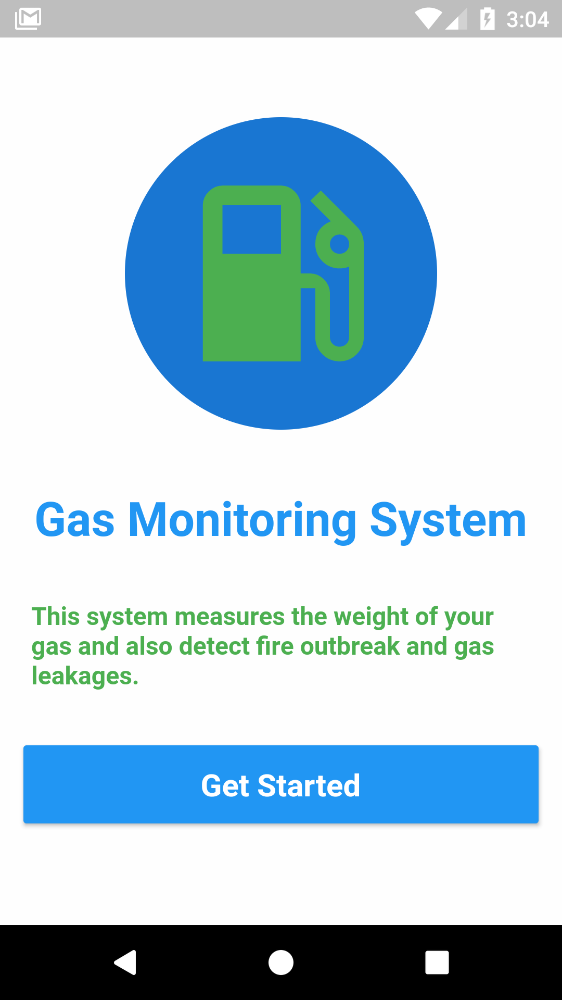
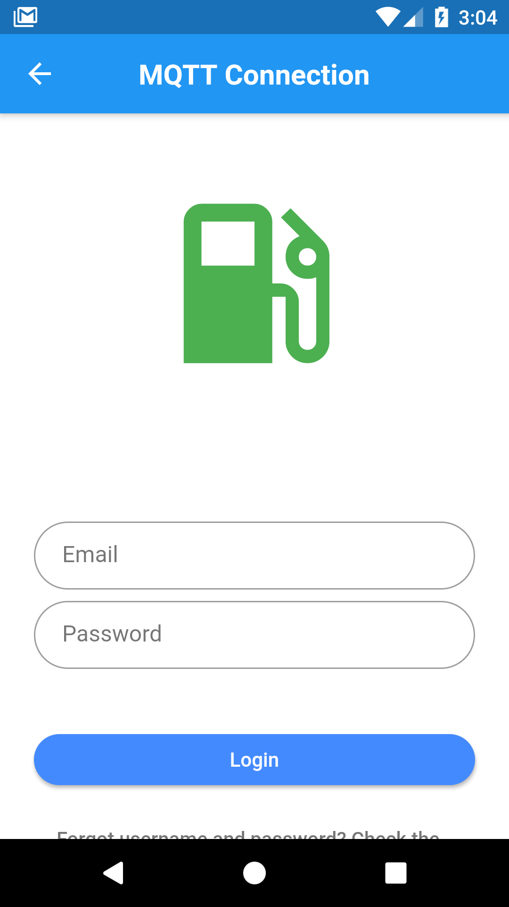
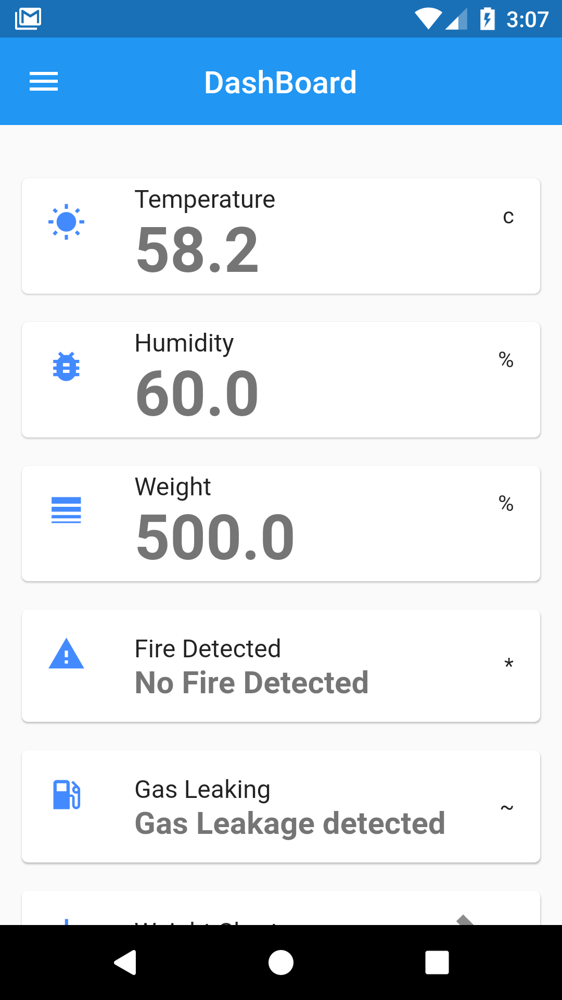

# Gas Monitoring System

The aim of this system is to provide a safety design by detecting the leakage of LPG used in our residential premises.
The leakage of gas is sensed by the gas sensor and notified to the user through the android app, the combination of the gas sensor and the android app make the system an advanced one.
 The system would determine the weight of the gas cylinder and alerts the user when the level of the gas falls below average.
 Also, the system alerts the user when there is a fire outbreak through the android app.

## Getting Started

This project is a starting point for a Flutter application.

A few resources to get you started if this is your first Flutter project:

- [Lab: Write your first Flutter app](https://flutter.dev/docs/get-started/codelab)
- [Cookbook: Useful Flutter samples](https://flutter.dev/docs/cookbook)

For help getting started with Flutter, view our
[online documentation](https://flutter.dev/docs), which offers tutorials,
samples, guidance on mobile development, and a full API reference.
